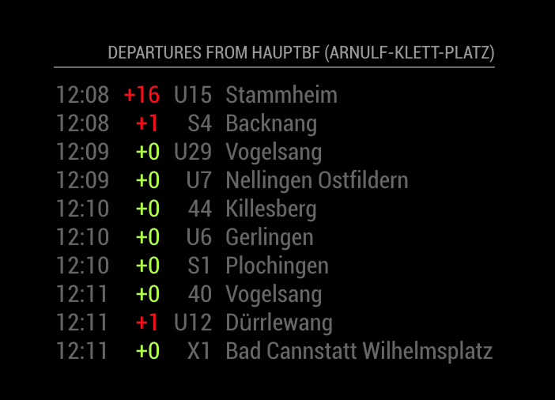

# MMM-vvsDeparture
A MagicMirror2 Module to display information about public transport in Stuttgart, Germany.

The `MMM-vvsDeparture` module is a module designed to display the departures times as stations along the Stuttgart public transportation system.
 It is configurable based on the stations to get destination times for, destinations to exclude and other options.

It also will show any delays, based on the real time information provided by VVS.

Example:




## Installation
Run these commands at the root of your magic mirror install.

```shell
cd modules
git clone https://github.com/niklaskappler/MMM-vvsDeparture
```

## Using the module
To use this module, add the following configuration block to the modules array in the `config/config.js` file:
```js
var config = {
    modules: [
        {
            module: 'MMM-vvsDeparture',
            config: {
                station_id: '<YOUR_STATION_ID_HERE>',
                // See below for more configurable options
            }
        }
    ]
}
```

Note that a `position` setting is not required.

## Configuration options
The following properties can be configured:

<table width="100%">
	<thead>
		<tr>
			<th>Option</th>
			<th width="100%">Description</th>
		</tr>
	<thead>
	<tbody>
		<tr>
			<td><code>station_id</code></td>
			<td>A value which represents the station id of the station. The id is combined of the area prefix `de:08111` and the unique station id e.g `6112` which result to `de:08111:2201. Here is a full list of all station with corespnding ids within the VVS public transport network, to find your station (<a href="https://www.openvvs.de/dataset/1f7ec4c1-b590-4751-a25b-57ef988c14b6/resource/d87d1f01-5c14-4d08-8452-e405a6472ab4/download/vvs_haltestellen.csv</a>).   
				<br><br><b>Possible values:</b> <code>integer</code>
				<br><b>Default value:</b> <code>de:08111:6112</code>
			</td>
		</tr>
		<tr>
			<td><code>station_name</code></td>
			<td>The displayed name for your station.
				<br><br><b>Possible values:</b> <code>string</code>
				<br><b>Default value:</b> <code>undefined</code>
			</td>
		</tr>
		<tr>
			<td><code>maximumEntries</code></td>
      		<td>Number of departure entries which will be shown.
				<br><br><b>Possible values:</b> <code>integer</code>
				<br><b>Default value:</b> <code>6</code>
			</td>
		</tr>
		<tr>
			<td>
			    <code>reloadInterval</code>
			</td>
     		 <td>The refresh rate departure entries will be updated in milliseconds. 
      			<br><br><b>Possible values:</b> <code>integer</code>
				<br><b>Default value:</b> <code>1 * 60 * 1000</code> e.q. one minute
			</td>
		</tr>
		<tr>
			<td>
			    <code>colorDelay</code>
			</td>
     		 <td>Define if the delay value should be colorized.
      			<br><br><b>Possible values:</b> <code>boolean</code>
				<br><b>Default value:</b> <code>true</code>
			</td>
		</tr>
		<tr>
			<td>
			    <code>colorNoDelay</code>
			</td>
     		 <td>Define if the no delay value should be colorized.
      			<br><br><b>Possible values:</b> <code>boolean</code>
				<br><b>Default value:</b> <code>true</code>
			</td>
		</tr>
		<tr>
			<td>
			    <code>number</code>
			</td>
     		 <td>Define the lane number which should be displayed. With this you can hide numbers you don't want to see.
      			<br><br><b>Possible values:</b> <code>String</code> / <code>Array</code> / <code>Function</code> 
				<br><b>Default value:</b> <code>undefined</code>
			</td>
		</tr>
		<tr>
			<td>
			    <code>direction</code>
			</td>
     		 <td>Define the lane direction which should be displayed. With this you can hide numbers you don't wont to see.
      			<br><br><b>Possible values:</b> <code>String</code> / <code>Array</code> / <code>Function</code> 
				<br><b>Default value:</b> <code>undefined</code>
			</td>
		</tr>
	</tbody>
</table>

